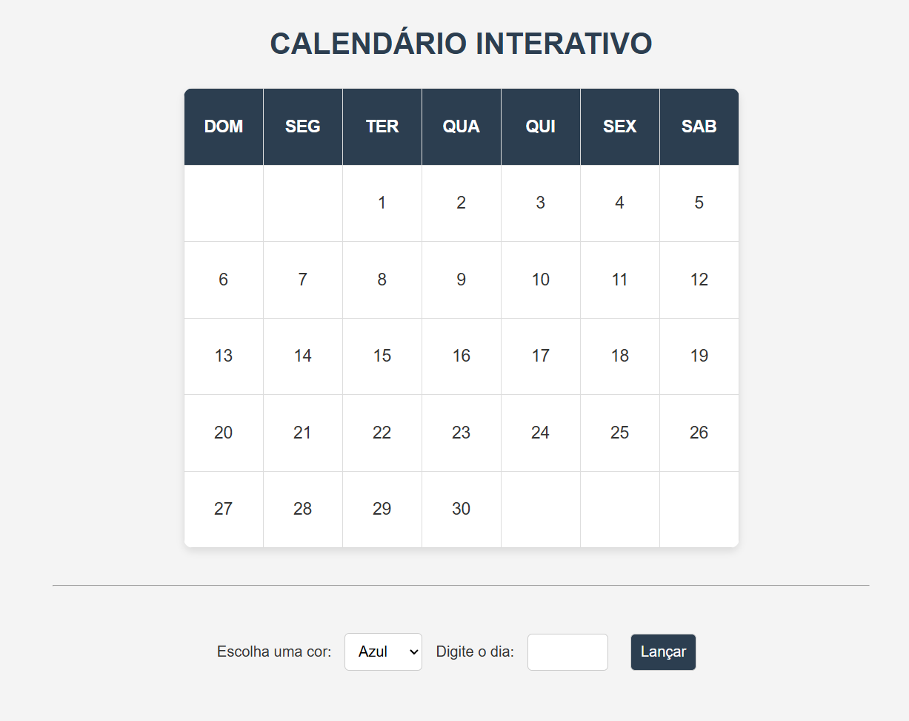

# 📅 Calendário Interativo

Este é um projeto desenvolvido por **Rennan Rentz**, com o objetivo de criar uma ferramenta visual simples e funcional para marcação de dias em um calendário mensal. Usando **HTML, CSS e JavaScript**, o usuário pode selecionar uma cor e aplicar a um dia específico do mês, tornando a navegação e o planejamento mais prático e visual.

## ✨ Funcionalidades

- Calendário visual com os dias do mês dispostos por semana.
- Seleção de cores para marcar os dias (Azul, Verde, Rosa e Roxo).
- Campo numérico para digitar o número do dia que deseja colorir.
- Botão para aplicar a cor ao dia escolhido.
- Interface intuitiva e responsiva.

## 💻 Tecnologias Utilizadas

- HTML
- CSS
- JavaScript 

## 📂 Estrutura do Projeto


## 🎨 Cores Disponíveis

- 🔵 Azul (LightBlue)
- 🟢 Verde (PaleGreen)
- 🌸 Rosa (LightPink)
- 🟣 Roxo (SlateBlue)

## 🚀 Como Utilizar

1. Clone este repositório ou baixe os arquivos ZIP:
   ```bash
   git clone https://github.com/seu-usuario/calendario-interativo.git

2. Abra o arquivo index.html no seu navegador.

3. Escolha uma cor no seletor, digite um número de 1 a 30 e clique em "Lançar".

4. O dia correspondente será colorido com a cor escolhida.



